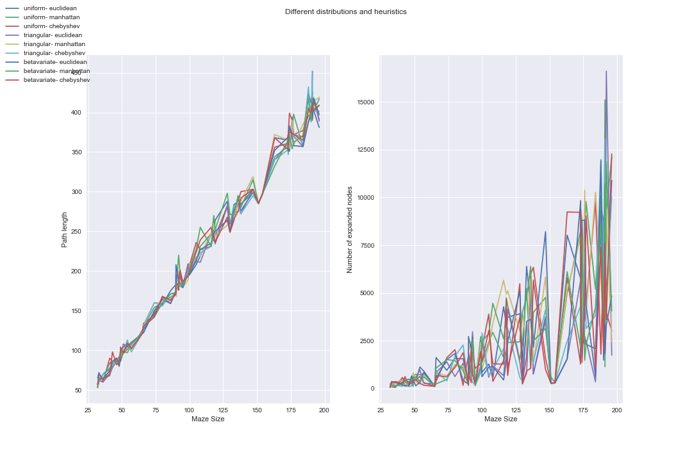

# Artificial Intelligence- NTUA
Programming exercises for the Artificial Intelligence course at NTUA ECE

## Prog 1
In this excercise I implement an A* algorithm with variable heuristics and I visualize it's fronts. Also I extract statistical information on it's performance depending on different heuristics.

## Prog 2
In this excercise I implement a simple movie recommender using python and prolog
